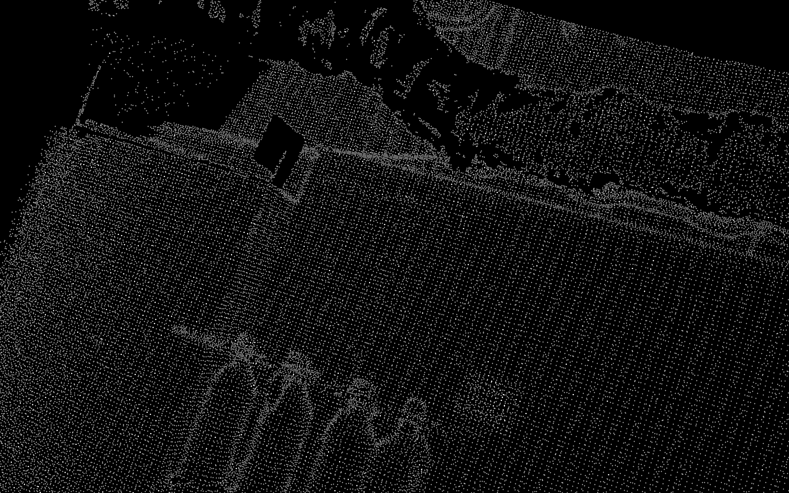
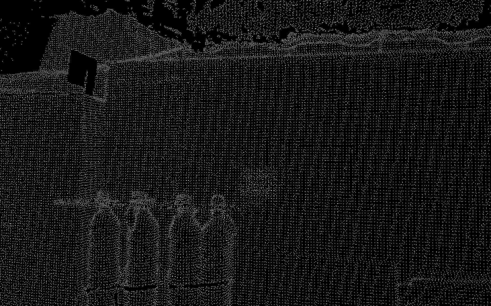

# Self-calibration of LiDAR and Camera

### Goal
Real-time calibration of a LiDAR and a Camera sensor by predicting the extrinsic matrix without external markers (checkerboards).

### Problems with previous work
- Most previous work in the LiDAR-Camera calibration domain, require external markers like checkerboards. 
- Deep learning based methods are not accurate enough for engineering applications, especially when the scene does not contain any descriptive features like a plain wall.

We use the base framework from LCCNet and improve the performance in feature scarce scenes by improving loss functions and optimization techniques.

## Requirements

```commandline
conda env create -f environment.yml
conda activate lccnet
pip install -e models/correlation_package/
```

Note: Ensure CUDA version matches pytorch version. Might work with the latest pytorch version (Not Tested).
Install latest pytorch [here](https://pytorch.org/get-started/locally/)

## Pre-trained model

Models pre-trained on KITTI dataset can be downloaded from [google drive](https://drive.google.com/drive/folders/1VbQV3ERDeT3QbdJviNCN71yoWIItZQnl?usp=sharing)

Models pre-trained on Helios (LiDAR) + Triton (Camera) sensors can be download from [here](https://cmu.box.com/s/1f0gxmcch65yh9dk68y3vfnlcc8d8tw8). These models are finetuned using 4000 random initializations.

## Dataset
1. DatasetLidarCamera: Dataset for KITTI odometry and raw datasets.
2. IPadDataset: Dataset for IPad sensors.
3. LabDataset: Dataset for helios and triton.

All three datasets work in the same way. Load the pointcloud + images, transform data, get a random extrinsic matrix as ground truth.
The LabDataset thresholds the pointcloud based on distance to only consider the points near the window plane.
IPad and Lab datasets can written batches of data using the `with_batch` argument.
Note: Make sure to update the intrinsic matrix in the dataset.

## Finetuning pre-trained model
1. Adjust the hyperparameters in the `train.py` script.
2. Use the correct dataset on Line 137.
3. Iterative training: Train each pre-trained model with max_t and max_r parameters as {1.5, 1.0, 0.5, 0.2, 0.1} and {20, 10, 5, 2, 1}, respectively. The pre-trained models should be loaded in `_config` on line 84. The order of the pre-trained models should be {5, 4, 3, 2, 1} corresponding to the order of the max_t and max_r parameters. This is important as the pre-trained models are pre-trained on the corresponding max_t and max_r parameters.
5. Then run the following command for each pre-trained model. Change the model savepath on line 322.
```commandline
python train.py
```

## Testing the trained model
The `test_sensor_setup.py` script loads a randomly initialized pointcloud and runs inference on it. The output are extrinsic matrices and pointclouds corresponding to each pre-trained model. The process is iterative, thus, the model 5 output is used as input to the model 4 and then model 3 and so on. Hence, the iterations specified on line 190 are starting from the highest range network i.e. model 5 at max_t=1.5 metres and max_r=20 degrees. 
The final extrinsic matrix is a combination of the predicted matrices.

## Extrinsic matrices
Each network predicts an extrinsic matrix. After the training task there will be 5 extrinsic matrices rt1 to rt5.
Please refer to the `projection.py` and `projection_utils.py` files for more information.
`projection.py` takes the predicted extrinsic matrices and produces the initial and final depth maps. One example of this is shown below. I have tested with IPad and Helios but it can vary with the type of sensor used. The main principle remains the same.

To run inference real-time, I would modify the `test.py` script to obtain the latest extrinsic matrix following the formula used in `projection.py`. The final pointcloud output from `test.py` is the final predicted pointcloud, so that can be used as well for downstream tasks.

### Initial depth image


Initial pointcloud projected with random extrinsic matrix.

### Predicted depth image


Initial pointcloud projected with predicted extrinsic matrix.

## Evaluation on KITTI dataset

1. Download [KITTI odometry dataset](http://www.cvlibs.net/datasets/kitti/eval_odometry.php).
2. Change the path to the dataset in `evaluate_calib.py`.
```python
data_folder = '/path/to/the/KITTI/odometry_color/'
```
3. Create a folder named `pretrained` to store the models pre-trained on KITTI in the root path.
4. Download pre-trained models and modify the weights path in `evaluate_calib.py`.
```python
weights = [
   './pretrained/kitti_iter1.tar',
   './pretrained/kitti_iter2.tar',
   './pretrained/kitti_iter3.tar',
   './pretrained/kitti_iter4.tar',
   './pretrained/kitti_iter5.tar',
]
```
5. Run evaluation.
```commandline
python evaluate_calib.py
```
